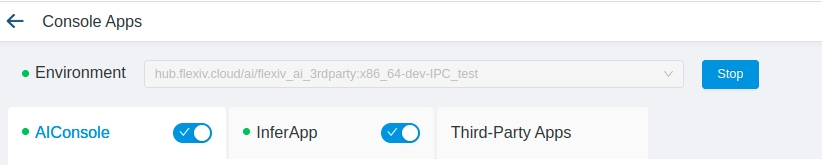

# Flexiv AIDK

Flexiv AIDK (AI Development Kit), is a development kit to enable flexible AI service calling and control with client.

## Compatibility Overview

| **Supported OS**               | **Supported processor** | **Supported language** | **Required compiler kit** |
| ------------------------------ | ----------------------- | ---------------------- | ------------------------- |
| Linux (Ubuntu 18/20/22 tested) | x86_64           | C++, Python            | build-essential           |

## Quick Start

### Setup
Before using c++ and python AIDK api, please make sure NoemaEdge is running.

Tips: for experienced users, if robot can run plan to send request to AI correctly, then everything is ready.

Here takes project `GRASPNET` as an example. To setup NoemaEdge App, take the following steps:

* Launch NoemaEdge
* Image loading and management
* License generation
* License import
* Software package download and import
* Software package configuration
* Program switch and logs

Finally, start environment and start program `InferApp`. Now the NoemaEdge App is ready and its status is shown below.

Note: If NoemaEdge is running remotely, please make sure the AIDK machine have network connection with it. For more details, please consult Flexiv members for help.

### C++ AIDK

The C++ interface of Flexiv AIDK is packed into a unified modern CMake library named ``flexiv_aidk``, which can be configured via CMake.

#### Compile and install for Linux

1. In a new Terminal, install C++ compiler, Git, and CMake (with GUI) using the package manager:

        sudo apt install build-essential git cmake cmake-qt-gui -y

2. Choose a directory for installing ``flexiv_aidk`` library and all its dependencies. For example, a new folder named ``aidk_install`` under the home directory.
3. In a new Terminal, use CMake to configure flexiv_aidk:

        cd release
        mkdir build && cd build
        cmake .. -DCMAKE_INSTALL_PREFIX=~/aidk_install

4. Compile and install ``flexiv_aidk`` library:

        cd release/build
        cmake --build . --target install --config Release

5. The user project can now find and link to the installed ``flexiv_aidk`` library:

        cd release/example
        mkdir build && cd build
        cmake .. -DCMAKE_INSTALL_PREFIX=~/aidk_install
        cmake --build . --config Release -j 4

   Note: ``CMAKE_INSTALL_PREFIX`` is set to the same directory where ``flexiv_aidk`` was installed to.
6. To run an compiled example program:

        ./test_aidk_compute [address] [config_path] [total_num] [enable_v1x]
        ./test_aidk_compute_image [address] [config_path] [total_num] 
        ./test_aidk_others [address] [config_path] [version]

     e.g. to communicate with NoemaEdge App (version v3.1.0) running in remote machine with ip 10.24.14.101:

        ./test_aidk_compute 10.24.14.101 ../../config/GRASPNET.json 1 false
        ./test_aidk_compute_image 10.24.14.101 ../../config/GRASPNET_IMAGE.json 1 
        ./test_aidk_others 10.24.14.101 ../../config/GRASPNET.json v3.1.0

     Note: Port ``18203`` is used, and ``sudo`` is not required unless prompted by the program.

### Python AIDK

A brief instruction is provided below and applies to Linux.

To run an example Python program:

        cd release/example_py
        python3 test_aidk_compute.py --ip [address] --config [config_path] --num [num] (--enable-v1x)
        python3 test_aidk_compute_image.py --ip [address] --config [config_path] --num [num]

For example, to communicate with local running NoemaEdge:

        python3 test_aidk_compute.py --ip 127.0.0.1 --config ../config/GRASPNET.json --num 1
The log is shown below:

        INFO:root:Namespace(config='../config/GRASPNET.json', enable_v1x=False, ip='127.0.0.1', num=1)
        INFO:root:Test config:
        {'project': 'GRASPNET', 'command': {'command': 'POSE6D', 'obj_name': 'GRASPNET_graspnet_0', 'coordinate_id': 0, 'camera_id': 'CAMID_0', 'instruction_id': -1, 'custom': 'test_0', 'camera_pose': [0.55, -0.034, 0.66, 0.0, -0.7071068, 0.7071068, 0.0]}, 'keys': ['obj_pose', 'double_value']}
        INFO:root:detect 0: 370.9 ms, 2.7 Hz, instruction -1
        INFO:root:state: True
        INFO:root:current detected object names: ['GRASPNET_graspnet_0'], current detected object nums: [1]
        INFO:root:key: obj_pose
        INFO:root:[0.5027717547217662, -0.003570836059272227, 0.25158332987576737, 0.08253609149323858, -0.3200245424326347, -0.943391842633212, -0.027998519512926395]
        INFO:root:key: double_value
        INFO:root:0.07259449357263434

### Example
Here is an example to get grasp pose in world frame using AIDK and RDK.  Remember to put flexivrdk.so under `relesae/example_py` in advance, then run

        python3 test_grasping_with_rdk.py --ai-ip 127.0.0.1  --config ../config/GRASPNET.json --robot-ip 192.168.2.100 --local-ip 192.168.2.107

and details can be found in test_grasping_with_rdk.py:

        robot = flexivrdk.Robot(robot_ip, local_ip)
        while not robot.isConnected():
                time.sleep(0.001)
        robot_states = flexivrdk.RobotStates()
        robot.getRobotStates(robot_states)
        camera_pose = robot_states.camPose

        # use aidk to get grasp pose
        client = aidk.AIDKClient(ai_ip)
        tic = time.time()
        config['camera_pose'] = camera_pose
        state = client.detect(
                **config,
        )
        key = "obj_pose"
        parse_state, result_list = client.parse_result(config["obj_name"], key, -1)
        grasp_pose = result_list[0].vect[0]

### Config

The example script `test_aidk_others.py` supports version>=v2.11.1 and`test_aidk_compute.py` supports version>=2.10.0.

For NoemaEdge version < v3.2.0, supported `custom` are:

 "POS3D", "POSE6D", "GRASP_POSE", "KEYPOINT", "BBOX", "CLASSIFY", "GET_INT_VALUE", "GET_DOUBLE_VALUE", "KEYPOINT3D", "CUSTOM".

 For NoemaEdge version >= v3.2.0, supported `custom` can be arbitrary command defined as workflow name in project editor.

Supported `keys` are:  "bbox", "keypoints", "positions", "obj_pose", "valid","double_value", "int_value", "name".

Note:  For Noema version >= v3.2.0, make sure "command" in config json is always "CUSTOM", and "custom" is the real workflow command.

## API List

| API | function | detail |  Noema version |
| ---------------- | ---------------- |---------------- | ---------------- |
| detect_v1x | computing | send a detect request V1x | >= v2.11.1
| detect   | computing | send a detect request   | >= v2.10.0
| detect_with_image   | computing | send a detect request with image  | >= v2.10.0
| get_detected_obj_names | computing | function to get all detected object names   | >= v2.10.0
| get_detected_obj_nums | computing | function to get all detected object nums   | >= v2.10.0
| get_detected_obj_num | computing | function to get detected object number based of object name  | >= v2.10.0
| get_detected_time | computing | function to get timestamp of detect request | >= v3.2.0
| parse_result | computing | function to parse detection result   | >= v2.10.0
| get_camera_intrinsic | computing | function to get camera intrinsic   | >= v2.10.0
| reload_configs| configure | reload project config | >= v2.11.1
| save_configs  | configure | save current project config   | >= v2.11.1
| is_ready | others | check whether AI Noema Edge is ready   | >= v2.10.0
| get_current_state | others | get current status of AI Noema Edge  | >= v2.10.0
| warmup | others | warmup current project, if configured on NoemaEdge   | >= v2.11.1
| all_direct_command | others | all direct commands   | >= v2.11.1
| get_runtime_info | others | function to get AIApp runtime info   | >= v3.1.0
| list_remote_files | others | list file and dir list under remote directory   | >= v3.1.0
| get_file_info | others | function to get remote file info   | >= v3.1.0
| send_file | others | function to send local file to remote file path   | >= v3.1.0
| receive_file | others | function to receive remote file to local file path   | >= v3.1.0
| send_folder | others | function to copy local folder to remote folder   | >= v3.1.0
| receive_folder | others | function to copy remote folder to local folder  | >= v3.1.0
| remove_path | others | function to remove remote files or folders  | >= v3.1.0
| make_remote_directory | others | function to make directory in remote  | >= v3.1.0
| get_direct_setting_variables | others | function to get variables  | >= v3.1.0
| set_direct_setting_variables | others | function to set variables  | >= v3.1.0
